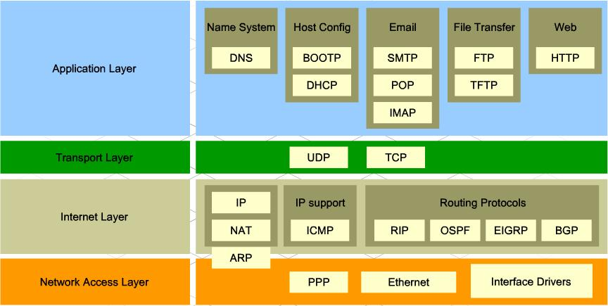
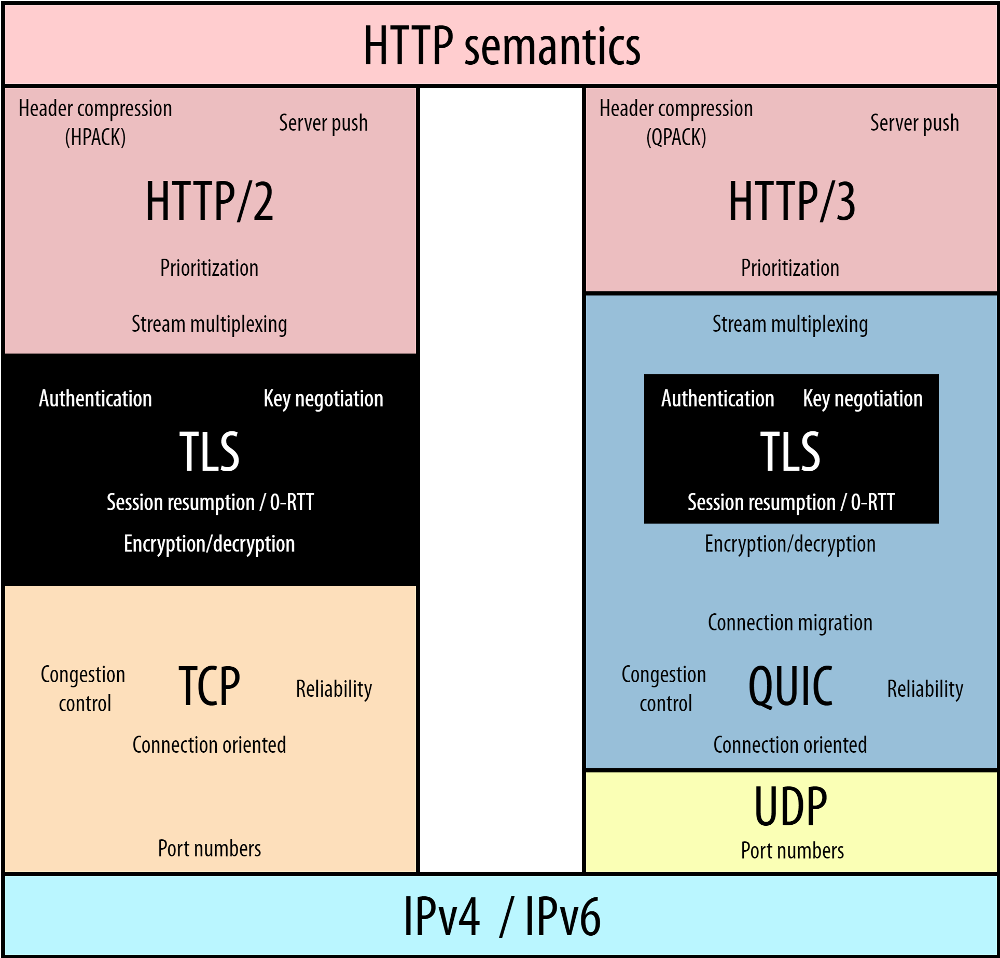

General Topic: Protocol | Status: In Progress

### Sources:
- [Everything you need to know about HTTP](https://cs.fyi/guide/http-in-depth)
- [Fundamentals of Backend Communications and Protocols](https://www.udemy.com/course/fundamentals-of-backend-communications-and-protocols/learn/lecture/34630270#overview)
- [HTTP/1 to HTTP/2 to HTTP/3](https://www.youtube.com/watch?v=a-sBfyiXysI&ab_channel=ByteByteGo)
- [HTTP/3 From A To Z: Core Concepts — Smashing Magazine](https://www.smashingmagazine.com/2021/08/http3-core-concepts-part1/)

---

### In a Nutshell...

HTTP is a protocol that’s built on top of the TCP/IP protocol. It is used as one of the standards to transport data on the internet. It resides in the application layer (highest level) in the TCP/IP model.



As it is built on top of TCP/IP, by default it uses TCP’s port, which is port 80. HTTPS, however, uses port 443.

### Versions

- [HTTP/0.9 (1991)](https://www.w3.org/Protocols/HTTP/AsImplemented.html)

    There were no headers, the only method allowed is GET, and the response has to be HTML. Pretty suck for today’s standard wouldn’t you think?

    - Request/Response Example:

        ```plaintext
        GET /index.html
        ```

        ```plaintext
        (response body)
        (connection closed)
        ```

    All in all, it’s a pretty straightforward protocol.

- HTTP/1.0 (1996)

    Headers got added, more methods added (POST and HEAD), new request/response formats, status codes were added, and the response could now deal with other formats such as images, videos, plain texts, etc.

    Many other useful and interesting things got added here. Now, this is far more usable in today’s standard.

    - Request/Response Example:

        ```plaintext
        GET / HTTP/1.0
        Host: cs.fyi
        User-Agent: Mozilla/5.0 (Macintosh; Intel Mac OS X 10_10_5)
        Accept: */*
        ```

        ```plaintext
        HTTP/1.0 200 OK
        Content-Type: text/plain
        Content-Length: 137582
        Expires: Thu, 05 Dec 1997 16:00:00 GMT
        Last-Modified: Wed, 5 August 1996 15:55:28 GMT
        Server: Apache 0.84

        (response body)
        (connection closed)
        ```

    Quite an interesting statement from [cs.fyi](https://cs.fyi/guide/http-in-depth) while we’re here.. HTTP stands for Hyper-text Transfer Protocol. But wait, now you could transfer images, videos, and other formats as well? It should’ve been HMTP or Hyper-media Transfer Protocol then.. lol

    The major drawback is that this version could not have multiple requests per connection. So, each time a client needs something from the server, it will need to open up a new TCP connection. Why is it a drawback? Well, so long as you don’t care about performance, it shouldn’t be a problem. Imagine you open up a site and each time you do and access a specific page you have to load each and every .js, .html, and any other files from the server. It gets annoying. Not to mention that establishing a new TCP connection requires a three-way handshake to be completed.

    To put it into perspective,

    You basically cold start a Windows PC that uses HDD as its main drive each time you access a page or reload a page. It’s pretty darn slow.

    

- [HTTP/1.1 (1997)](https://datatracker.ietf.org/doc/html/rfc2616)

    New methods added (PUT, PATCH, OPTIONS, DELETE), it now has persistent connections (more on it later), the client could now send multiple requests to the server, and many more features added.

    If you’d like to understand the key differences between HTTP/1.0 and HTTP/1.1, go check it out [here](https://www.ra.ethz.ch/cdstore/www8/data/2136/pdf/pd1.pdf).

    To this day, HTTP/1.1 is still widely used on the internet. Even though HTTP/2.0 and HTTP/3.0 have already been introduced. I guess, this version alone has most of the features that would be used even in today’s standards. Not to mention it’s been there since 1997, which means most of what’s on the internet is using HTTP/1.1. That being said, it is by no means flaw-free. As you may know, there are more resource-intensive sites now more than ever. And this version is pretty slow due to its limitation in establishing many connections at the same time per server (the limit is not set by the protocol itself, but by the client, which in this case is a web browser). For example, AFAIK, Chrome limits up to 6 connections at once per server for HTTP/1.1.

    So if your website needs to load more than 6 files, the rest of the files have to wait until any of those 6 connections are closed first. Therefore, it would lead to more delay due to said overhead.

- HTTP/2 (2015)

    18 years later, HTTP/2 was born. It was designed for low latency transport of content. In this version, it uses binary instead of texts, it has introduced multiplexing, the header is compressed using HPACK, it’s possible to have multiple responses for a single request, and more.

    Other than the new stuff they added in this new version, the underlying is still pretty much the same as that of HTTP/1.1.

    Even the header format is still the same.

    Now, however, due to its use of Binary Protocol, it is no longer human-readable.

    If you’d like to learn more about its specs, you could read it [here](https://http2.github.io/http2-spec/#FrameTypes).

- HTTP/3 (2022)

    

    HTTP/3 is fundamentally a tweaked HTTP/2 to allow it to sit on top of the QUIC protocol. It could’ve been named HTTP/2-over-QUIC but due to marketing and clarity reasons (according to Smashing Magazine).

    So then the important question here is that what is QUIC? Why is it being introduced?

    Well, QUIC stands for Quick UDP Internet Connection**.**

    QUIC was introduced to fix the fundamental problem of HTTP, which is the transport protocol. TCP is too old, with a lot of issues for today’s standards. But, changing TCP directly could not be an option because then the internet would crumble apart.. slowly.. surely.. not because the end clients (phones, PC, laptops) cannot be upgraded to suit the new TCP, rather it’s all the devices that sit in the middle (firewalls, servers, proxies) that cannot.

    QUIC itself is another generic transport protocol, much like TCP and UDP. So then why is it sitting on top of UDP? The reason is the same as above. It’s that all of the devices on the internet would need to be updated first to recognize QUIC.

    Although it’s recently introduced (since the initial draft in 2020), it’s already been used by 25% of the websites.

<details>
  <summary><em>Did You Know?</em></summary>
  <p>
    UDP, or User Datagram Protocol, is the leanest and meanest transport protocol around. It strips down to the essentials, only providing port numbers (like HTTP on port 80 or DNS on port 53). There’s no handshake, no connection setup—just pure, unadulterated speed. If a packet gets lost, UDP doesn’t care; it won’t resend it. This “best effort” approach means blazing-fast performance with zero wait for handshakes or error checks. UDP shines in live, high-frequency updates where outdated data doesn’t matter, like video calls or online gaming. Need low upfront delay? DNS queries love UDP for its single-trip simplicity. When milliseconds matter, UDP is your go-to guy.
  </p>
</details>
