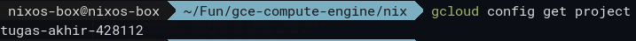
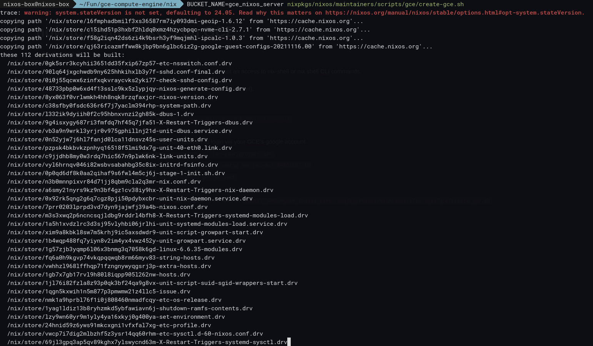
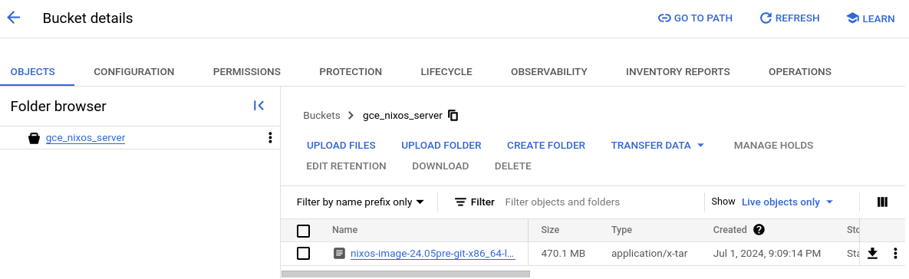
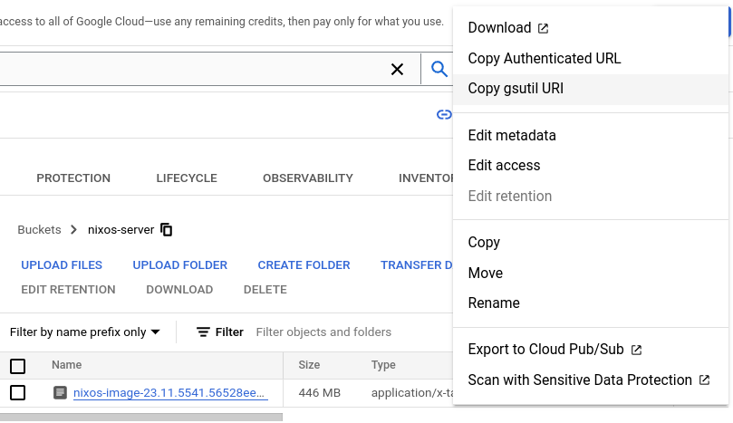
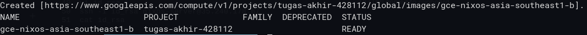
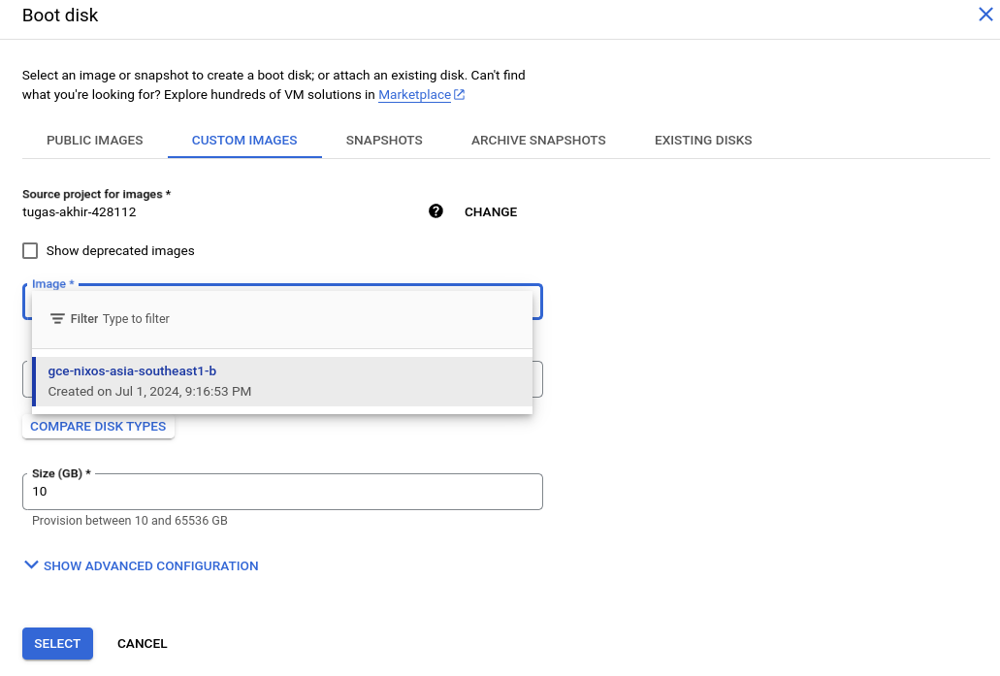
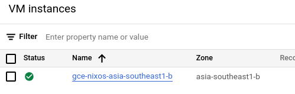

### ⚠️ Prerequisites:

> 1. make sure you have a running NixOS on some machine or at least an access to nix-shell or nix shell CLI commands.
> 2. you have enabled Cloud Storage Buckets API on your project.
> 3. you have created a bucket on your project (write down the bucket’s name!).

### Steps:
1. on your NixOS, clone nixpkgs.
    ```bash
    git clone --depth=1 --branch <nixOS_version> https://github.com/NixOS/nixpkgs.git
    ```

2. run.
    ```bash
    nix shell nixpkgs#google-cloud-sdk
    ```
3. run
    ```bash
    gcloud auth login.
    ```
this will redirect you to your browser to login via your GCE’s google account.

4. export your PROJECT_ID with this command.
    ```bash
    export PROJECT_ID=<your_project_id>
    ```
5. set your project on Google Cloud SDK with this command.
    ```bash
    gcloud config set project $PROJECT_ID
    ```
6. you can then check if it has been set using.
    ```bash
    gcloud config get project
    ```
    this should print out your PROJECT_ID.

    

7. now, you can run this command to upload NixOS.tar image on your Bucket:
    ```bash
    BUCKET_NAME=<your_bucket_name> nixpkgs/nixos/maintainers/scripts/gce/create-gce.sh
    ```

    

8. wait until it’s done.

    this process will run a *shell script* that will install NixOS, compress it to .tar, and then upload it to your Bucket.

9. you can then check it on your Bucket. there will be a new file in there.

    

10. next step is to set your to-be-installed server’s *compute/zone* a.k.a. location. this can be done using
    ```bash
    gcloud config get compute/zone <your_preferred_zone>
    ```
    e.g.
    ```bash
    gcloud config get compute/zone asia-southeast1-b
    ```
11. copy the URI of the NixOS image on your Bucket. you can do so by opening the image’s menu and Copy gsutil URI.

    

12. now is the time to create a new image on your Google Compute Engine using the custom image you just created and uploaded to your Bucket.

    run this command:
    ```bash
    gcloud compute images create <your_server_name> --source-uri <your_image_uri>
    ```
    for instance:
    ```bash
    gcloud compute images create gce-nixos-asia-southeast1-b --source-uri gs://gce_nixos_server/nixos-image-24.05pre-git-x86_64-linux.raw.tar.gz
    ```

13. well done! now if it’s there’s nothing wrong, you’ll get this printed on your screen

    

14. now you can create a new instance on your Google Compute Engine as usual, but this time config the *Boot Disk*, go to *Custom Image*, and then select the newly-created image.

    

15. when everything’s good with your instance config, you can proceed to create your instance. after that you can go check your Compute Engine, there should be a new instance there!

    
