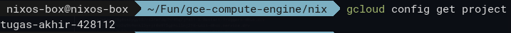
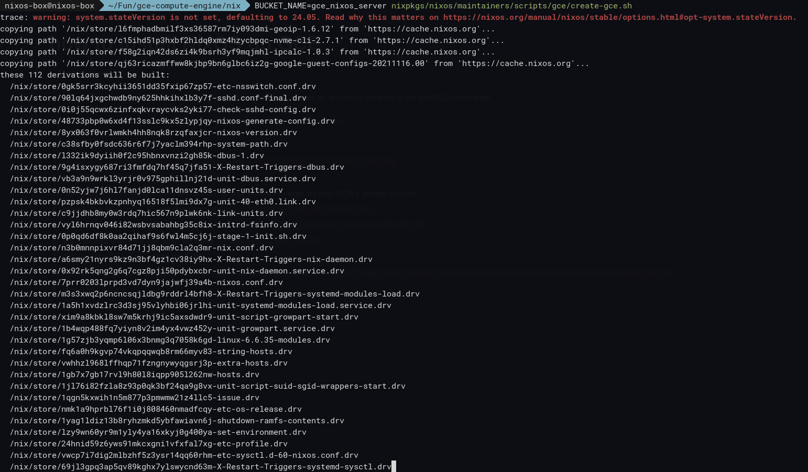
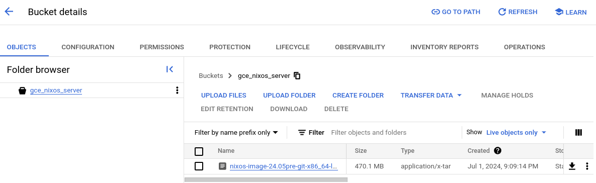
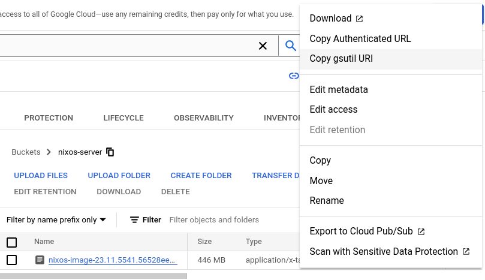
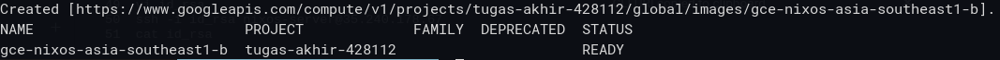
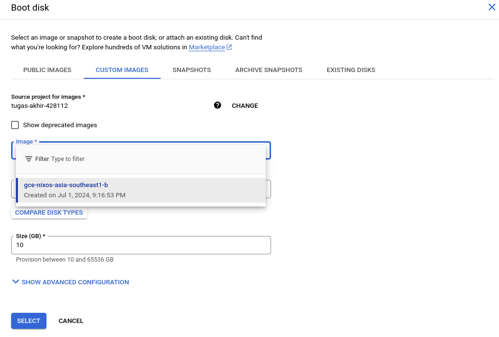
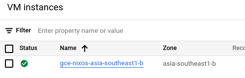

### ⚠️ Prerequisites:

> 1. make sure you have a running NixOS on some machine or at least access to nix-shell or nix shell CLI commands.
> 2. you have enabled the Cloud Storage Buckets API on your project.
> 3. you have created a bucket on your project (write down the bucket's name!).

### Steps:
1. on your NixOS, clone nixpkgs.
    ```bash
    git clone --depth=1 --branch <nixOS_version> https://github.com/NixOS/nixpkgs.git
    ```

2. run.
    ```bash
    nix shell nixpkgs#google-cloud-sdk
    ```
3. run
    ```bash
    gcloud auth login.
    ```
this will open your browser to log in with your GCE Google account.

4. export your PROJECT_ID with this command.
    ```bash
    export PROJECT_ID=<your_project_id>
    ```
5. set your project on Google Cloud SDK with this command.
    ```bash
    gcloud config set project $PROJECT_ID
    ```
6. you can then check it was set with:
    ```bash
    gcloud config get project
    ```
    this should print out your PROJECT_ID.

    

7. now, you can run this command to build and upload the NixOS image to your Bucket:
    ```bash
    BUCKET_NAME=<your_bucket_name> nixpkgs/nixos/maintainers/scripts/gce/create-gce.sh
    ```

    

8. wait until it's done.

    this process runs a *shell script* that installs NixOS, compresses it to a .tar, and uploads it to your Bucket.

9. you can then check it on your Bucket. there will be a new file in there.

    

10. next step is to set the *compute/zone* (a.k.a. location) for the server you're about to create. you can do this with
    ```bash
    gcloud config set compute/zone <your_preferred_zone>
    ```
    e.g.
    ```bash
    gcloud config set compute/zone asia-southeast1-b
    ```
11. copy the URI of the NixOS image in your Bucket. you can do so by opening the image's menu and selecting Copy gsutil URI.

    

12. now is the time to create a new image on your Google Compute Engine using the custom image you just created and uploaded to your Bucket.

    run this command:
    ```bash
    gcloud compute images create <your_server_name> --source-uri <your_image_uri>
    ```
    for instance:
    ```bash
    gcloud compute images create gce-nixos-asia-southeast1-b --source-uri gs://gce_nixos_server/nixos-image-24.05pre-git-x86_64-linux.raw.tar.gz
    ```

13. well done! if there's nothing wrong, you'll get this printed on your screen

    

14. now you can create a new instance on your Google Compute Engine as usual, but this time configure the *Boot Disk*: go to *Custom Image*, and then select the newly-created image.

    

15. when everything's good with your instance config, you can proceed to create your instance. after that you can go check your Compute Engine, there should be a new instance there!

    
